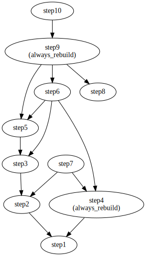

.. _tests:

Tests
=====

The PyDesignFlow test suite validates core functionality including dependency resolution, result passing, file management, and error handling. All tests use pytest and are located in the ``tests/`` directory.

Basic Flow Execution
--------------------

Tests in ``test_single_block.py``:

- Result.json file creation for all tasks
- Sequential execution of dependent tasks
- Complex dependency chains with nested dependencies
- Result passing and accumulation between tasks
- ``ResultRequired`` exception when dependencies are missing

Multi-Block Flows
-----------------

Tests in ``test_multiple_blocks.py``:

- Block-to-block task dependencies
- By-ID references (``=A1.stepY``) and dependency map references (``a.stepY``)
- Parameterized blocks with initialization arguments
- Tasks with multiple cross-block dependencies
- Result propagation through multi-block chains

Dependency Resolution
---------------------

Tests in ``test_dependency_list.py``:

- Dependency sequence generation and correct task ordering
- ``build_dependencies='missing'`` vs. ``build_dependencies='all'`` modes
- Incremental builds that skip satisfied dependencies
- Always-rebuild tasks that execute even when results exist
- Complex multi-level dependency trees

Result Serialization
--------------------

Tests in ``test_result.py``:

- JSON serialization and deserialization of Result objects
- Data type preservation: strings, dicts, integers, floats, booleans, Path objects, datetime objects
- Result reconstruction from JSON files

Error Handling
--------------

Tests in ``test_exitcode.py``:

- Subprocess error propagation
- SystemExit on task failures
- CLI error reporting

File Management
---------------

Tests in ``test_filemgmt.py``:

- ``checkfile()`` and ``checkdir()`` validation
- FileCollection for organizing files with custom attributes
- Querying, filtering, and iterating file collections

.. _flow_example1:

Example Flow
------------

The test suite includes ``flow_example1``, a complete example flow used to test dependency resolution and result passing. It contains an ``ExampleBlock`` with 10 tasks that form a complex dependency tree, including tasks with multiple dependencies and tasks marked to always rebuild.

This example flow is used by ``test_single_block.py`` and ``test_dependency_list.py`` to verify correct behavior.

   ExampleBlock dependency graph showing the relationships between step1 through step10

.. _flow_example1_autodoc:

Auto-generated Reference
~~~~~~~~~~~~~~~~~~~~~~~~~

The following documentation is generated using the :ref:`sphinx_ext` directive.

.. designflow:: tests.flow_example1
